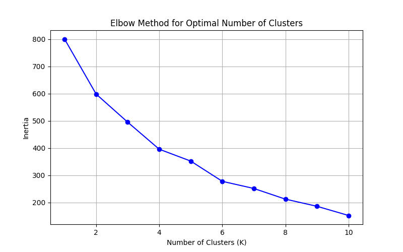

# 🧠 Task 8: K-Means Clustering -- Mall Customers Segmentation

## 🎯 Objective

Perform customer segmentation using **K-Means Clustering** on the **Mall
Customers Dataset** to identify customer groups based on spending
behavior and income levels.

------------------------------------------------------------------------

## 📂 Project Structure

    Clustering__AI-ML/
    │
    ├── Data/
    │   └── data.csv             
    │
    ├── src/
    │   ├── data_loader.py                  
    │   ├── model.py                        
    │   ├── evaluate.py                     
    │   └── utils.py                        
    │
    ├── outputs/
    │   ├── elbow_method.png                
    │   ├── cluster_visualization.png       
    │   └── silhouette_score.txt            
    │
    ├── requirements.txt                    
    └── main.py                             

Optional Mall_Customers.ipynb  # Notebook for Testing and Evaluation
------------------------------------------------------------------------

## 📊 Dataset Description

**Dataset Name:** Mall Customers Dataset\
**Columns:** - `CustomerID` → Unique customer identifier\
- `Gender` → Male/Female (encoded numerically)\
- `Age` → Customer's age\
- `Annual Income (k$)` → Annual income in thousand dollars\
- `Spending Score (1-100)` → Spending score assigned by the mall

------------------------------------------------------------------------

## ⚙️ How to Run

### 1. Clone the Project or download .zip
git clone https://github.com/Mamoonkhan11/Clustering___AI-ML
cd Clustering__AI-ML


### 2. Setup Environment

``` bash
python -m venv .venv
.venv\Scripts\activate
pip install -r requirements.txt
```

### 3. Run the Main Script

``` bash
python main.py
```

### 4. View Outputs

All visual results are saved in the `outputs/` folder: -
**elbow_method.png** → Determines optimal number of clusters (K) -
**cluster_visualization.png** → Plots customer segments -
**silhouette_score.txt** → Evaluation metrics

------------------------------------------------------------------------

## 🧩 Learn from this Project

-   Unsupervised learning fundamentals\
-   K-Means algorithm and cluster analysis\
-   Elbow method and Silhouette score interpretation\
-   Geared up Data preprocessing and scaling techniques

------------------------------------------------------------------------

## 📈 Output Samples

### Elbow Method



### Cluster Visualization


------------------------------------------------------------------------